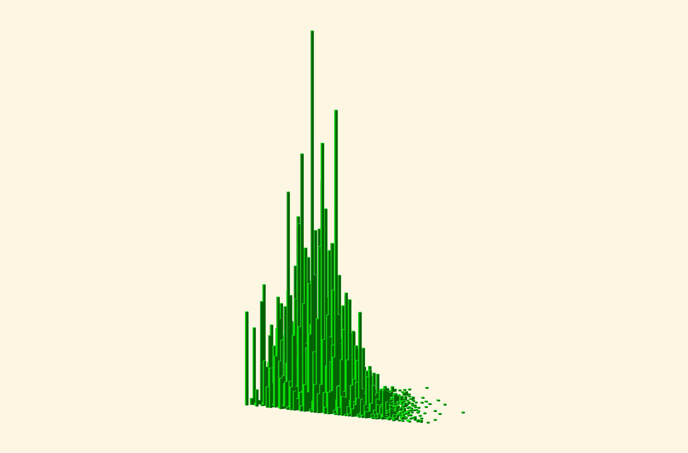

# Explorable 3D rendering

I've created a 3D rendering of the Scorigami mountain, which [you can explore yourself here](https://ochafik.com/openscad2/#H4sIAAAAAAAAA5WdYY8UxxGG/wraBMmWzg7TPTszC7IiJ+EkHOUUkVgkAhwtxwJn3d2S2zubMyG/PTtr2VbczyO9yHww8FJdVW91dXV39dz7xdv11fpit7j/frE+vT77bvPX9fWbxf3F796er29fX21vLl9+vjtdv1wcLV5t1tc3V5s99unifP3D7Wc3l2fby8Xzo8Vue3N1eviL93t59u9Pt5fXm8vr/V+ebs+3V588W5yfXWyeLT698/7Z5fXV+nJ3vr7efPL03tGd+dfzT++c3rzY/747urP/VYfPl88/ffBrZEfQey20E2xXfo0sDASZlZGl/hrYxyKXMXLIbR8Z2jd6TvHoK/HmxCR1kdBOoB05PsENIW4UXKviFBsz21JAZjN4Z0jyUBEseQhwheMIkBP5iEZu5s8Uqrhi3IpdWSHUwZpOsFMP2I6xLUNFgC2yMnJFSYYkcpIBZEEiCThyQiCHNmpOoYdWgoOxZ4J6GBsyRyfYvkcqAdkE54FKAELUHbgkmY2XZhQhwXoZHiLZRr9HSwYAMRmSQJgZo/gdlwEauzLvy8hHnUA7mu+FsTTdK0OZzkymiGzCbghxI+PQ7ySP3T4Q6+h1QPbk9Y6xnDkBOCI5BKTRe8bierBMFRjEUUQ5mQ4hLyK7ZvBRxm78OYV+X4VWz5yPUYoT5GjrKmA5OgjYFKaH8ADkkobvReq9JnUeooOsAqkDQ/t2iRltfM4fAK2NUFEUk3wkUJQkh04MlV0BadmE0xxNU1T+dAKF6XYIJ4BSWqg5tM+hS4ZSkA45dGQoBKlYhVFCJlGQkJJE5yor/zrDEqEdY60OACgzTzKXQj1h28VzKUjknYDkqpGxtc1jkzi1Aa4YKKkJkFAoi+1yZgFIONkR0zsYPrVdTG82uvsAzXbOM5BOYCiSBDvgBoWQnVS0hF1iSUvIvkUuGUnbs0EcQFN5NLNI8CTaUjgTsIAG4leI0iJktdt98T8VouKrQucsaPsAcY9a4rKc2TMb3oE9uFlAZBvPHSM58AHYjl1FYuOhQ9QDcomFYKblIEBZuHH4trydGElzY8VQyg/iUQt54hNScxFGuR5BXSFGxa9dQ5U4lbap4lUuXNH/NEFgcWh3kwK0M13EYuAnR7WHuCcgl6wEJT2Hj7BpFCyHfqjAiqFQExTxf3sO24mimOsB2KQncSjV4IRrHCSehImZe1Ic2Yw9e5GOlGWfRtjaMt4x0qYGQK0WIl15VciQS0ZSgTfEQkdGDu1CN4lLcWLQ8XuTPMWfTXAWYbO7x8sBWQ7Zpsj4TQYrxiavMaQpDC8cUQITkipWYdlFjpAEwTQ7n65IbNoBdqBc3zHWJh6JlYlH2uJ2mpAjl2N0ASETj6412jV5ZOREdz+TKIBTj25A+O4HobJ8AXRJS52wOhLWVKC5arwSVpgFqEmlE88wWCUC6KxAQqDnm36UStOacHJgQLc7Mq1DaMdQm9V0sSazGqDt2tMzUI5HEYpzOhp8ZGA791ciUeYeOaldTMXzTZIo4vdGzSJe5wmX3GWKQLqgDFkUlzdGi8e5U6bQpRbPCron41OH5DbvMCUASLOnip7tRq2X0UnqkrHtSjPI8DTTRsG2E2NiJCWalVglc4igvP8iTW31ontfWbxIATrPMLbazkDhilZwYYsP2lGorHQAxTNEEtkAhX2pXrM4mbmnK8g2ewtyydOZZMoaR/e0OJ1JJh+nkMjWoqXIxMlMN6VctQISbg4mRtpJCg1PkRxLLcLnAEFShNGe6mZRAVZk4bTdhRfhtMNSWGglu4zYdostxDaxYjZxwwkOjgki9L6ECh6N0p0y9rsiso39jpFUrxaG8rSn0dtNaM9I2NguRSZOezIIm0hwcFrtp9T2FQPb2cE4m/Nkert4Cpltvi0yPK3dwmZn6zwqIDOe5LbTWChtfSqM0mFqEUblioUUlexA0CbyRdOe2tFQIuUQ8jzlkLDfQ6B0llMYaiU+dZFwbwgqgMkhbQ3JgCMD6XBuYig2hhCwoaiI49t472KGijDUbqSFn3YjLexQdZHyU4QfqgKEoXb7I/y0Bgk/sp8gJjkhZNPN7OFygQIO9wl0wt4WdYij+zm6VeFxqRtCHiQRFjqwOkbKKRxB25uiysAiXYqIpaSwFKv4dJ2dRUkJFcAjB0RSTiIgdToIUVD4C1EdTWNhCssQHJ4qJmGKKrsiTMmBA+rK2Qn9StnRyCIVhC+IK/EXtkjbfIVsRjh+/oQ2NeuNGE/1TRQnsykdbeUw8QASDieKIDGbELCddz0j2xa0QyYBpFyQE5SOHA65hMTimQd6lM88CNpuP0RRyToRn4esQy5t9xMyPNZCqCfNYmOUsoNw2tpkjFLSE0ap7bkIp+3rsyKUNnEqrqL0XIXTdotehdPGUeJQPt/lsTmHRQEl3sQcRr7kAgq6h7h6StqMDjks7AGrIlNKIurYkuRETd+YmbLu8ENqokYwSU2Z/UV8SsVDF7uqiFcp54lX20S2DH1axPmWRiKZ4nyyXZzfJFzxUZsXhCJ62y0UQYiKk8CgPETFcmoLr2EXnkDpdUthaDvnKgOpw6lnaMeVS9iEOOTmjzI+9vYRkvLYKh6/iPvlAiZkqghTlkiydrgiXLX1mFBFwwtVbX4wokioUMWZJD2qyFiqQmjbR12NzwYobLZaippSt9DhC6Wm6Dsa4nJuZQ6RsyupUZCmnGHlLTxiMeFR6xsmvHT0XoRKq0mmwMBAOlwfRSZ5dUo9tWIgP3EhpFVONLo8cUEs5TFRgaBCbHssbKySUGGV6yxqKsXkmHrKOG3rQSOVsiP5s93VCaMtUOjsaf+X01lF0zblCp2Nj4RKybgJlzo9KeNmQwuP/MmXit9xwXxLSNosdYLFfBu1m1YbHbMtiaT6dilYqTABim9HUCY+q8q8tIrVFH9aro17aBHZ5sSUziJ04iUhjt0edQmXdg4f+lPYpBtSo9OO4RPqxU8wfBU+qWI1Qi3XhmJF2bYOFlJbifn8FEpl700y+asqYUgJn5hus/bYTqB83Bb1UfcM5I132HA95NBR9JQqNJS6Yig+l0N/SmkZdlGXXKq43+rFyChxP3YypoOL8/HEPmyfFt+3daV5HtNSOLjoSVeeOUVVKJLUlNgkFEFekpiXDTV1hkq+ocZU+ZIPYjE3Ra22h+SE3dZStlG7LWanrCn4kJ3Cz4xNqfWrUE9xp1Vt0efYDkmMkLRDFwUo4QmjBBVK+fQwcWgRPlvjczaLsNle5qZsiodgZ16FTc6L5CGu1xJfViMSkyJ2rEtWzCZcFS4p1wqb/G3uEGmpgbIyep7LxcwiCSXpwMMmZ8ngcdM+Ia0TLoRW0ZWwvegq3z8hLJ+Jht8hHGV860rJvi5YjK52YysU2KM6xEp6DvvyjQJaIIQC21yHUCHBsnT6iED4ws11GK9ViOVMjbxips4cVUVT3lkDkPKvUUrf77CJhZk6tEkYlaSeIUVPvOSi0Mcj1/D1BIYHJ/T8/UQKrQy1zJt1fx+SZNR2L5pSAdvl0NyoIkYRdIjtL2I/SZ1EKian+JFAJLLm3q/ifZqfJSS/5jTVnKZDego1zRmtOaNVGMVte/yaoqeeZp76BJUP8BJUCrRUgZ6h+HQqHX6Q4SnvEBB34uHgJXd+EY/Kxpmg7bQX10vTTch9yZ1fxPl4UpjKFPfLhUc0fB6iVRiVS4wo8qoNT5ksjJGak1TF962XzPMNMPW7hQfenyAS7MmnZ6rmzHlHg2MGJSRtMCtj231zL0LlkJKwlhgBKt2LqIG0LBMWy7fI/kNmpNEpNxXBcqFHUJIqDNCuWQiQPWvIVREC2kdskwAlOZKmlBwBJ02JoUVVSG3ve4xRzKIUeFwRIvWYRWmOUDWYaWlTiWtBnnWYbzO/i570cVkcm5vFw3k0h0f0mWIBys/iIqg8+yAofkB/yVjLoyF0FA0oj0652BVD5agQPYtJF3+qnyTd8J2G0CUXOQSlVJZTUISC9uJF/E/HhOJ/zKTJs6cqLMlDkTD+q9DEmTQCCkU0uEwoOfdLrbcJJdk0MkrYhGDqhSeC2nyiBB1+/TtNZrOW0deiBUgpp8uhJYdWhmJTEQHx24gEbG/NRxlaMnNo0CqGltz5RZwvPeipVHG+HRaED2/Er7axzxQwVTHlZaNXsUlOCVNFLawwPYXD50HV50HVi0+lhky8n9qemz6bE31824CSycJvn1eG4qePMz2X+eADQzmThbav4uGLeNROMsNHOiVXQJzfniuI8+VVYOTTIj4l6yeRyVksM76K99uEJ77nGi8cXBza5jDxktxzhCT1YrsVWYmmvcQdVmPJRBbL2xNCmXF45Jh/EZ6gcDpZBImJLnyh0tvosqkOP0g/iFjZVKc/FHoVekA8ZYkxen3SydhtH+FHjC5MyW01QeXLd6lUIwpTaPJO45BAky/YFyOTM23yjKraXMI8Sx+7l2135swqevLGOwm6Kky2B5g2izBzZ7mhCkGWuTMue/Fnm+TFSVLRxj/kIE42czAlzyQO6TZ8eNLn0CGHTjH0kMWitx+5UYd0E0LHHJoblataxXwrm0JoTlXNrepzt+bjr2LkHP3RcwkB4tcPCEg1QZ8OPohMrDJIS5ki0cMCMcgW70jmMgWKQfjFpFBLIwiX2VCkONMmXDS8kG7rUiLzsColwHxsiziakpnE2e1hp7pA8av5BLRJGckccpkjQ9vXpatYZjE34UQHIH63noD4Qj0Dii/lWSdCsZSPgOJ0edaZQoUhyTPZ04gqXHJBH44ubPIZSyhT+LTT5xAqRNlJcQgVV3FODGXmRvUSpgTN7c+FikyslDKJs+uTL+x3ArT7ufxHGxCUL92Sj/EfznnCwYccOqbDr2KZRTzapjzxZ9uAJd60mi58E5B7tIhH5aVBCp1yqLgfuyEinPie0n3u/Sret4wbaWoOxV1cBMxjuc+zQ59nB4smyopJDsvt2ZsTH+6Fh8qzyKTfd850GXAUIB89E1TOWEKpRTSV85AQWlP752vbUKZ4SojvMp9+BLQyVM7YCIovf1OZY6xpEaMsUEKpYr/FFEFpqUk1/Qj7p1zqKtTUjKelJhy7ipdk/UihufFzdZ1CRQE6XRcFKOETjn+49TL83PlHQCtDbT6HLcJjrsAqVqDkZh1mdPbd7yJm4ZFgqqnYb8tJ2PQaiqxivLxNT6WKn2yiRjblfqriJ5qmElJ0hhiKtHiGsizCzZEctVMK0KZn3iOZQscYOp/nhFARim4K27q6HFoZyuVrKHMVQ0suteZG1Vxqn0OXuQJjjJxJjbpnBGiUhtCeoW1VOsYyi5kkC1MIFaPahUlMkqOK0KgqmsqWOYTK+Pzefhl9GDMG9ilwFKDM+/AeXfS0IEmbA9Lhhxw6xVAZnzcEochlDDWeKJTyC2+C2qYxv3xNoTWGzlaF3/bqY2gRqZx0QpljDK059LDDii8GltHJvABtxcm/2UNQCr8hlnoIv/yAPIVOMXSMkXuv0pdR7zWDI442QgSD/ssBkc218qxfepw5dBnnYwydZ1wIFaFUNg/hnv4joD1D28wwxTJrjBxlcJ4YQ/4AKYTOJU4IHWPkLDN/NjLk/ckhdBaa90uG0L1Q+igqPTdGJN9MRJ9PXSKOb2OoZavJDKMMzASN4QXCGEPnC6YxmyDz+HHUhU0fCKRtYgocUuBeR1ox22tixHGmASB8TmbJI4MlBIPIGBFZflz9Pjy7XHx4frTYvHu7vbo+3l5drK/Lnxb3F7vvXi/+/4/r4Y+vzxcfjhbfnW2+X9x/vzjfvt4t7l9f3WyOFufr2+3N9fynF9uXmz324ub8+mwv5NX29GaPerU+3+1hm5dn19urn/7RLGjz8+/2uOvtxdkP858c4PuhTrfn5+u3u83LP/78l39fv9jLe/r88JezrMVvXq1ejuV0P9juzfb7L99tftHq7HJzcnPxYnO1+0Xm26vNTxa8OL+5erPevdkL+c/x33YP//yPkw//+ubi4VePjta3v3/07sU3F7sHD786OX53unvw5Mv17bdP79bdg0efPbrcvpr/7+T45Pjh6ck/v/jv3Xpy/Ohyfbt7sHvw2b+3rx5+9fjub4+2rx7f/fb57sH2dvtq98XjuyfHuwfvXjy+++N/8/9/+/Tk+Mkf9oi/zP9qljdL+Pbpk6/XtyfH69sZsZdxs3395OsnXy8+fPgfnHL4wdO1AAA=).



Read on to find out how to generate an animated version like this in this video:

https://github.com/user-attachments/assets/c66e8321-09f7-405e-8587-06433abdc562

# How to make a video

## Prerequisites

These programs are meant to be run in sequence - each program performs one step
in eventually creating a fully rendered video. They are meant to be run in a
POSIX-like shell prompt, so if you're running Windows, you'll need to install
WSL (Windows Subsystem for Linux) to run it.

Ensure that you have the following programs installed: `python3`, `jq`, `sed`,
`wget`, `openscad`, `ffmpeg`, and GNU Parallel.

## Downloading all the games for all the scores

This repository contains a full CSV list of the ~1000 scores that have happened
in NFL history in `all-scores.csv`. Note this does NOT record every game, only
the most recent game to match a certain score.

We start by running the `all-score-pairs.py` program to extract just the winning
and losing score from `all-scores.csv`:

```bash
> ./all-score-pairs.py all-scores.csv
20 17
27 24
23 20
...
```

Pro Football Reference provides a webpage where you can get every game for a
given score, so we want to iterate through the list of box scores we get from
`./all-score-pairs.py`, and for each box score we download the corresponding
page. This is what `./download-all-score-htmls` does - it takes a list of box
scores as input, and downloads a webpage of all the games for a given score to a
page in the directory `scores`:

```bash
> # We get all the score-pairs, and use the `|` operator to pipe all those
> # box scores to ./download-all-score-htmls
> # We pass '10' to download-all-score-htmls to tell it to wait ten seconds
> # between each download - this is neighbourly, it would be very rude to make
> # too many downloads from Football Reference too quickly.
> ./all-score-pairs.py all-scores.csv | ./download-all-score-htmls 1
...
https://www.pro-football-reference.com/boxscores/game_scores_find.cgi?pts_win=20&pts_lose=17
Resolving www.pro-football-reference.com (www.pro-football-reference.com)... 104.18.13.41, 104.18.12.41, 2606:4700::6812:d29, ...
Connecting to www.pro-football-reference.com (www.pro-football-reference.com)|104.18.13.41|:443... connected.
HTTP request sent, awaiting response... 200 OK
Length: unspecified [text/html]
Saving to: ‘games/games-20-17’
...
> # Once all is downloaded, we can list the games/ directory with `ls` to see
> # all the webpages we've downloaded
> ls games/
games-20-17
games-27-24
...
```

## Extracting the games to JSON

Now that we've downloaded the HTML for each page, we can scrape out the game
data as a much more manipulable format, JSON. We can run `extract-games.py` on a
list of files to get all the games in all the files as one big list:

```bash
> ./extract-games.py games/games-20-17 
...
[{"week_num": 5, "game_day_of_week": "Sun", "game_date": "1944-10-15", "game_outcome": "W", "winner": "Cleveland Rams", "game_location": "@", "loser": "Detroit Lions", "boxscore_word": "boxscore", "pts_win": 20, "pts_lose": 17, "yards_win": 177, "to_win": 3, "yards_lose": 236, "to_lose": 6, "boxscore_titl
...
```

Extract all the games from all the scores into one JSON file called
`all-games.json` with the following command:

```bash
> ./extract-games.py games/* > all-games.json
```

We can run queries over the `all-games.json` file using one of my favourite
programming languages, `jq`. For example, the following program (from
`sorted-scorigamis.jq`) gives the game that was scorigami for every score in NFL
history:

```bash
> jq 'reduce .[] as $item ({}; .[$item.boxscore_title] += [$item]) | map_values(min_by(.game_date))' all-games.json
...
  "9_7": {
    "week_num": 6,
    "game_day_of_week": "Sun",
    "game_date": "1922-11-05",
    "game_outcome": "W",
    "winner": "Chicago Cardinals",
    "game_location": "",
    "loser": "Buffalo All-Americans",
    "boxscore_word": "boxscore",
    "pts_win": 9,
    "pts_lose": 7,
    "yards_win": 0,
    "to_win": 0,
    "yards_lose": 0,
    "to_lose": 0,
    "boxscore_title": "9_7"
  }
}
```

## Render the JSON to a 3D model

But now we'd like to render the result to the same style as Jon Bois's graph in
the Scorigami series. For this, I reach for `openscad`, which is a convenient
rendering program for making 3D models similar to what you may already be
familiar with (Autodesk Fusion, SketchUp, Blender), but is unique in that it's
entirely driven by its own coding language.

So, by writing a `jq` program that takes in `all-scores.json` and outputs a
OpenSCAD program, we can render our Scorigami results to actual 3D!

For example, the `./scores-to-openscad.jq` will create an OpenSCAD program that
renders a column of the correct height for every score, to give us the same
visualization Jon has:

```bash
> # Run scores-to-openscad on all-scores, and save the resulting OpenSCAD
> # program to scorigami-mountain.scad
> ./scores-to-openscad.jq all-scores.json > scorigami-mountain.scad
> # Open this program in OpenSCAD and see the visualization!
> openscad scorigami-mountain.scad
```

When I run the commands above, I get a pannable, 3D view of the Scorigami map:


## Render the 3D model to a video

To generate a video that shows the evolution of the Scorigami board over time,
we have another program, `./scores-to-openscad-animated.jq`, which lets us
choose the `nth_game` to show all the scores up to. We can render a frame for
each `nth_game` using the `openscad` command line, and then stitch those frames
together.

We use `parallel` to run the frame generation using every core on the computer -
this lets me generate the whole video in "only" 5 minutes.

```bash
> ./scores-to-openscad-animated.jq all-games.json > animated.scad
> # A frame will be generated from the animated.scad program for every game in NFL history
> ./render-all-frames animated.scad frames 17950
> # About 5 minutes later, all frames are in the frames folder...
> ls frames
...
```

Finally, we can stitch together these frames to make a video using `ffmpeg`:

```bash
> ffmpeg -framerate 60 -pattern_type glob -i 'frames/*.png' -c:v libx264 -pix_fmt yuv420p video.mp4
```

The resulting video is very cool, I'll link it again here:

https://github.com/user-attachments/assets/c66e8321-09f7-405e-8587-06433abdc562
